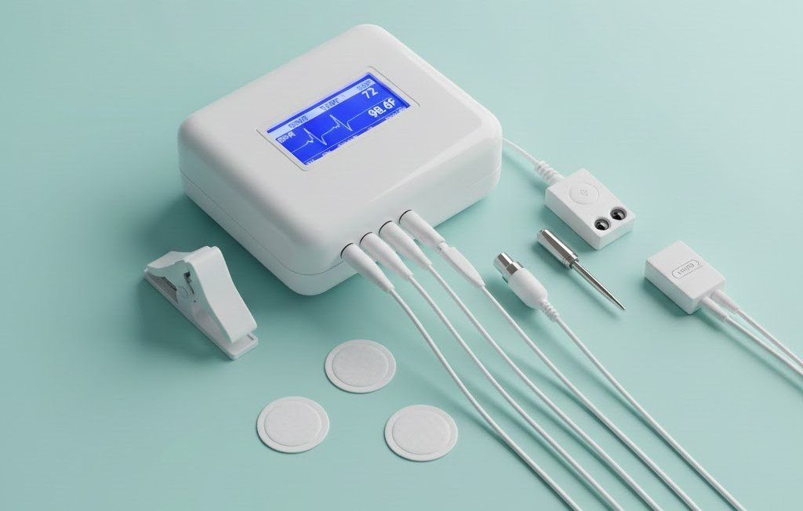

# EVOLVE – Integrated Patient Monitoring System

**EVOLVE** is a prototype **integrated patient monitoring platform** designed to collect multiple health metrics through a single hardware–software ecosystem. The system combines **embedded electronics, biomedical sensors, and IoT communication** to provide real-time patient data for clinical observation and analysis.

Developed as an undergraduate research project by students from the **Department of Physics & Electronics, University of Kelaniya**, EVOLVE explores how low-cost embedded systems can be used to build accessible healthcare monitoring solutions.

  

---

## Overview

Traditional patient monitoring often requires multiple independent devices to measure different physiological parameters. **EVOLVE addresses this limitation by integrating several health measurements into one unified platform**, enabling continuous monitoring and simplified data collection.

The system is built around an **ESP32 microcontroller**, which interfaces with multiple biomedical sensors to capture and process physiological signals. These signals are then prepared for **IoT transmission**, allowing remote monitoring, data logging, and further clinical analysis.

---

## Health Metrics Monitored

EVOLVE is designed to monitor both **body composition indicators** and **vital signs**, providing a broader view of patient health.

### Body Composition
- Waist Circumference
- Body Fat Percentage

### Vital Signs
- Blood Pressure
- Heart Rate
- Blood Oxygen Saturation (SpO₂)
- Body Temperature
- Electrocardiogram (ECG)
- Respiratory Rate

---

## Hardware Architecture

The system integrates multiple biomedical sensors connected to the ESP32 platform.

| Component | Purpose |
|-----------|--------|
| **ESP32** | Main microcontroller for data acquisition and communication |
| **Pulse Sensor** | Heart rate detection |
| **AD8232 ECG Sensor** | ECG signal acquisition |
| **MAX30100** | SpO₂ and pulse oximetry |
| **LM35** | Body temperature measurement |
| **CNY70** | Respiratory signal detection |

---

## Key Features

- **Modular Sensor Integration**  
  Easily expandable architecture that supports additional biomedical sensors.

- **Real-Time Data Acquisition**  
  Continuous measurement and processing of physiological signals.

- **IoT-Enabled Communication**  
  Sensor data can be transmitted to cloud platforms for monitoring and storage.

- **Prototype-Oriented Design**  
  Built to demonstrate practical clinical usability and embedded system integration.

---

## Project Objective

The goal of EVOLVE is to demonstrate how **embedded systems and IoT technologies can be combined to create a cost-effective patient monitoring solution**. By consolidating multiple physiological measurements into a single device, the system aims to assist healthcare professionals with **more comprehensive patient data for better decision-making and personalized care**.

---

## Authors

Developed by
- **P.D.J.P.D. PATHIRANA**
- **K.G.K. GUNASEKARA**
- **E.G.Y. HANSAMALI**
- **H.B.J.C. WICKRAMARACHCHI**
- **H.T. HETTIARACHCHI**

---
  **Undergraduate Eectronics Researchers of**  
**University of Kelaniya**

---

## Future Improvements

- Mobile or web dashboard for live patient monitoring
- Cloud database integration
- Improved signal processing and filtering
- Miniaturized hardware enclosure for clinical deployment
